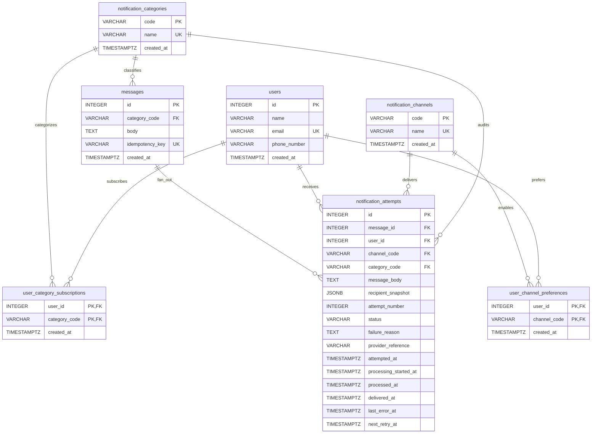

# Notification Challenge

Small notification service built for a backend-focused code challenge.

Current status:

- Backend API is implemented with message submission, fan-out dispatch, audit
  logging, migrations, and seed data.
- Frontend includes the required submission form and newest-first log history UI
  from the brief.

## Stack

- Backend: FastAPI, SQLAlchemy, Alembic, PostgreSQL
- Frontend: React, Vite, TypeScript, Tailwind CSS, shadcn/ui, TanStack Query
- Infrastructure: Docker, Docker Compose, GitHub Actions
- Tooling: `uv`, `pytest`, `pyright`, `ruff`, `pnpm`, Biome

## Features

- Submit a message by category
- Resolve subscribed users and preferred channels
- Dispatch through channel strategies
- Persist one audit row per delivery attempt
- Protect duplicate submissions with optional `Idempotency-Key` request headers
- Queue attempts separately from executing them so the same domain flow can run
  in-process or from a worker later
- List logs ordered newest to oldest

Supported categories:

- `sports`
- `finance`
- `movies`

Supported channels:

- `sms`
- `email`
- `push`

## API

- `GET /v1/health`
- `GET /v1/catalog`
- `POST /v1/messages`
- `GET /v1/logs?limit=10&offset=0`

`GET /v1/catalog` returns the backend-owned catalog used by the UI:

```json
{
  "categories": [
    { "code": "sports", "label": "Sports" },
    { "code": "finance", "label": "Finance" },
    { "code": "movies", "label": "Movies" }
  ],
  "channels": [
    { "code": "sms", "label": "SMS" },
    { "code": "email", "label": "E-Mail" },
    { "code": "push", "label": "Push Notification" }
  ]
}
```

`POST /v1/messages` accepts an optional `Idempotency-Key` header. The first
request with a key stores it on the submitted message. A later request with the
same key, category, and body returns the original dispatch summary with `200 OK`
and does not create another message or another set of notification attempts.
Reusing the same key with a different category or body returns `409 Conflict`.

Delivery logs include enough information to verify delivery to subscribers. Each
log item exposes the message details, channel, status, timestamps, errors when
present, and a `user` object with the recipient id, name, email, and phone
number captured at dispatch time. Log history is paginated server-side with page
sizes of `10`, `50`, or `100`, and responses include `items`, `total`, `limit`,
and `offset`.

Example request:

```json
{
  "category": "sports",
  "body": "Team A won the championship"
}
```

## Run With Docker

Prerequisites:

- Docker Engine or Docker Desktop
- Docker Compose v2

Create local environment files:

```bash
cp backend/.env.example backend/.env
cp frontend/.env.example frontend/.env
```

Start the full stack:

```bash
docker compose up --build
```

The Compose command starts PostgreSQL, applies Alembic migrations, seeds
deterministic demo data, and then starts the backend and frontend services.

To run the stack in the background:

```bash
docker compose up --build -d
docker compose logs -f backend frontend
```

App URLs:

- Frontend: `http://localhost:5173`
- Backend: `http://localhost:8000`
- OpenAPI: `http://localhost:8000/docs`

Stop the stack:

```bash
docker compose down
```

Reset the database volume and reseed from scratch on the next run:

```bash
docker compose down -v
```

## Local Development

Copy the example environment files first if they do not already exist:

```bash
cp backend/.env.example backend/.env
cp frontend/.env.example frontend/.env
```

Backend:

```bash
docker compose up -d db
cd backend
uv sync --group dev
source .venv/bin/activate
alembic upgrade head
python -m app.seeders.run
uvicorn app.main:app --reload
```

Frontend:

```bash
cd frontend
nvm use
pnpm install --frozen-lockfile
pnpm dev
```

## Tests

Backend:

```bash
cd backend
source .venv/bin/activate
pyright
ruff format --check app tests
ruff check app tests
uv run pytest tests/
```

`uv run pytest tests/` now enforces a minimum backend coverage threshold of
`90%` through `pytest-cov`.

Frontend:

```bash
cd frontend
nvm use
pnpm test
pnpm typecheck
pnpm format:check
pnpm lint
```

Bruno E2E:

```bash
docker compose up -d db migrate seed backend
cd bruno/notification-api
bru run --env-file ./environments/local.bru
```

The Bruno collection validates the public API from the outside in against the
seeded Docker environment:

- `GET /v1/health`
- `GET /v1/catalog` backend-owned supported categories and channels
- `POST /v1/messages` happy path
- `POST /v1/messages` duplicate replay through `Idempotency-Key`
- `POST /v1/messages` validation failure for blank bodies
- `GET /v1/logs?limit=10&offset=0` newest-first audit history after message
  submission

Backend unit tests and dependency-override route tests cover the lower-level
service, repository, validation, and error-handling paths that are awkward to
force through the Bruno collection.

## CI/CD Workflow Local Test

The GitHub Actions workflow can be smoke-tested locally with
[`act`](https://github.com/nektos/act). Run these commands from the repository
root with Docker running:

```bash
act pull_request -W .github/workflows/ci.yml
act push -W .github/workflows/ci.yml
```

To run one job at a time:

```bash
act pull_request -W .github/workflows/ci.yml -j backend-checks
act pull_request -W .github/workflows/ci.yml -j frontend-checks
```

The `publish-images` job only runs for push or manual workflow events on the
default branch, `main`, `master`, or tags. When it runs under `act`, the
workflow builds the Docker images but skips the GHCR login and push step because
`ACT=true`.

## Database Diagram



## Schema Notes

`notification_attempts` is the notification attempt audit entity for the system.
It stays separate from `messages` so one submitted message can fan out into many
independently tracked attempts without losing per-user or per-channel failure
details.

The dispatch flow is intentionally split into two phases: queue pending attempts
first, then execute ready attempts. The API still runs both phases in-process
today, but the same service boundaries can be reused by a background worker
later without rewriting channel orchestration.

Messages can store a nullable `idempotency_key`. A unique index enforces one
message per key while still allowing clients that do not need replay protection
to omit the header. Duplicate submissions are replayed from persisted message
and attempt state instead of dispatching again.

`user_category_subscriptions` and `user_channel_preferences` stay normalized
instead of being embedded on `users` as arrays. That keeps category targeting
and channel selection independently queryable, indexable, and ready for future
changes such as retries, reporting, and more granular preference rules.

The demo data is loaded by `python -m app.seeders.run`, which seeds the
normalized operational tables directly. That keeps the runtime schema smaller
while still giving local and Docker environments a deterministic, repeatable
dataset.

## Tradeoffs and Future Scalability

- Dispatch still runs in-process for the challenge to keep setup and review
  simple.
- The dispatcher now separates queueing from execution, so one or more workers
  can claim and process pending attempts later without changing strategy logic.
- `notification_attempts` stores pending, processing, and finalization
  timestamps plus `next_retry_at`, which provides the lifecycle metadata needed
  for retries and queue-based execution later.
- Idempotency keys are stored directly on `messages`, which is enough for
  duplicate POST replay in this challenge. A production version would usually
  add client ownership, key expiration, request fingerprints, and stronger
  concurrent-insert handling across horizontally scaled API nodes.
- `/v1/logs` returns seeded recipient contact details so the demo audit history
  can verify exactly who received each notification. In production this endpoint
  would require authentication, role-based access, access auditing, and field
  masking or redaction for viewers who do not need full PII.
- Pending-attempt selection uses row-level `SKIP LOCKED` claiming so concurrent
  dispatch workers do not process the same audit row.
- Future production extensibility would focus on a real queue migration design,
  claim leases with explicit expiration, and stronger auth and PII-handling
  rules for log access.
