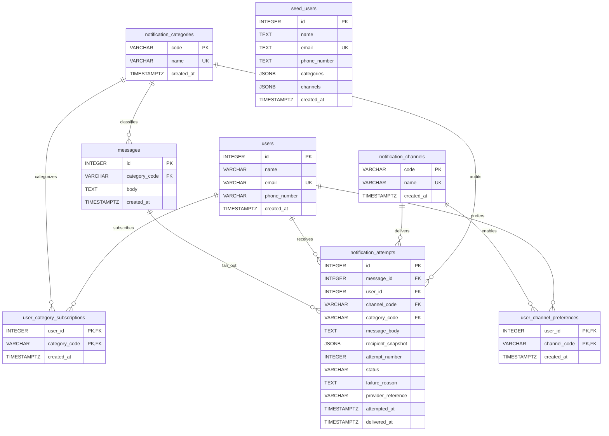

# Notification Challenge

Small notification service built for a backend-focused code challenge.

Current status:

- Backend API is implemented with message submission, fan-out dispatch, audit logging, migrations, and seed data.
- Frontend is still a lightweight setup page, not the final form-and-history UI from the brief.

## Stack

- Backend: FastAPI, SQLAlchemy, Alembic, PostgreSQL
- Frontend: React + Vite
- Tooling: `uv`, `pytest`, `pyright`, `ruff`, `pnpm`, Biome

## Features

- Submit a message by category
- Resolve subscribed users and preferred channels
- Dispatch through channel strategies
- Persist one audit row per delivery attempt
- List logs ordered newest to oldest

Supported categories:

- `sports`
- `finance`
- `movies`

Supported channels:

- `sms`
- `email`
- `push`

## API

- `GET /v1/health`
- `POST /v1/messages`
- `GET /v1/logs`

Example request:

```json
{
  "category": "sports",
  "body": "Team A won the championship"
}
```

## Quick Start

```bash
cp backend/.env.example backend/.env
cp frontend/.env.example frontend/.env
docker compose up --build
```

App URLs:

- Frontend: `http://localhost:5173`
- Backend: `http://localhost:8000`
- OpenAPI: `http://localhost:8000/docs`

## Local Development

Backend:

```bash
cd backend
uv sync --group dev
source .venv/bin/activate
alembic upgrade head
psql -h localhost -U postgres -d notifications -f db/seed.sql
uvicorn app.main:app --reload
```

Frontend:

```bash
cd frontend
nvm use
pnpm install --frozen-lockfile
pnpm dev
```

## Tests

Backend:

```bash
cd backend
source .venv/bin/activate
pyright app/
ruff format --check app tests
ruff check app tests
uv run pytest tests/
```

Frontend:

```bash
cd frontend
nvm use
pnpm test
tsc --noEmit
pnpm exec biome format --check src
pnpm exec biome lint src
```

## Database Diagram



## Schema Notes

`notification_attempts` is the notification attempt audit entity for the system. It stays separate from `messages` so one submitted message can fan out into many independently tracked attempts without losing per-user or per-channel failure details.

`user_category_subscriptions` and `user_channel_preferences` stay normalized instead of being embedded on `users` as arrays. That keeps category targeting and channel selection independently queryable, indexable, and ready for future changes such as retries, reporting, and more granular preference rules.

`seed_users` is only a bootstrap source used to load deterministic demo data into the normalized operational tables. Runtime reads and writes use `users`, `user_category_subscriptions`, and `user_channel_preferences`.

## Tradeoffs and Future Scalability

- Dispatch runs in-process to keep the challenge small and easy to review.
- The service/repository/strategy split keeps the domain logic ready for a queue or worker later.
- `notification_attempts` already stores status, timestamps, provider references, and failure details, which is enough to support retries in a later iteration.
